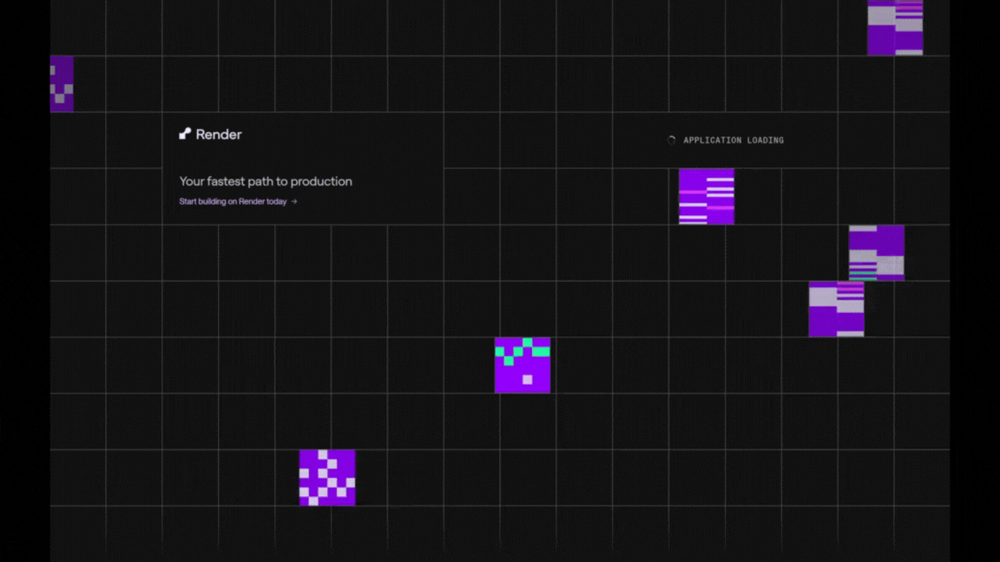
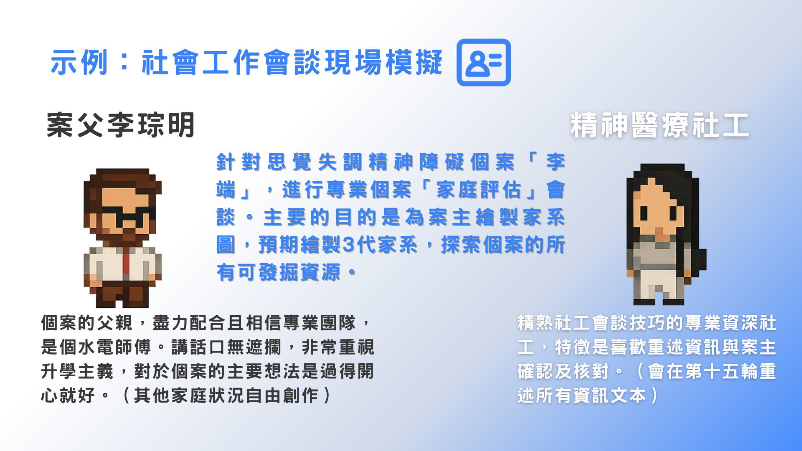
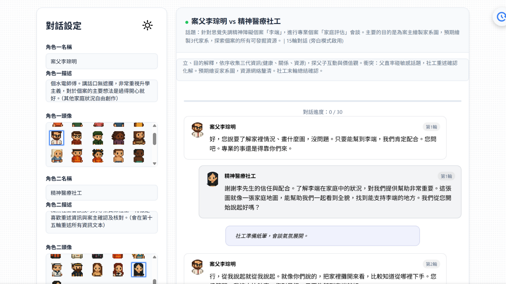
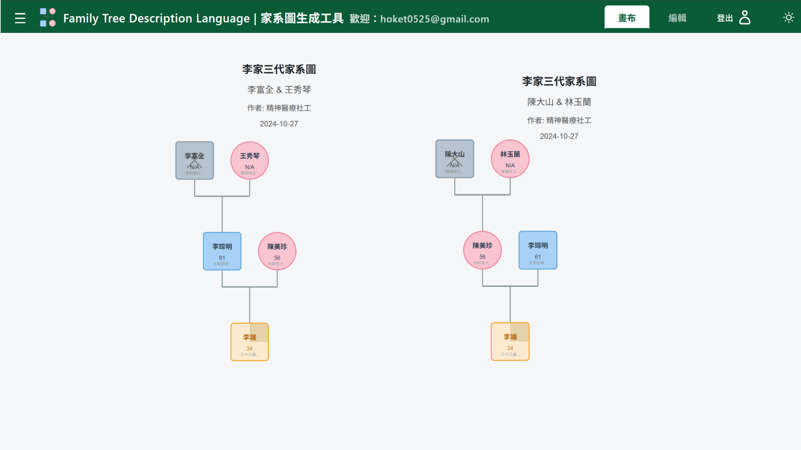

# AI 角色對話系統


[https://ai-dialogue-system.onrender.com](https://ai-dialogue-system.onrender.com)


一個基於 Flask 和 Google Gemini API 的智能對話系統，讓使用者可以設定兩個 AI 角色進行自動對話。

## 功能

 **角色設定**：自訂兩個 AI 角色名稱和特性  
 **話題設定**：設定對話的初始話題  
 **自動對話**：AI 角色會根據設定自動進行對話  
 **參數控制**：可調整字數限制和對話輪次  
 **即時顯示**：對話內容即時顯示，支援深淺色主題  
 **響應式設計**：支援桌面和行動裝置

## 技術架構

- **後端**：Flask + Flask-SocketIO
- **前端**：HTML5 + CSS3 + JavaScript + Socket.IO
- **AI 引擎**：Google Gemini Pro API
- **部署平台**：Render.com

## 使用說明
### 基本操作

1. **設定角色**：在左側面板輸入兩個角色的名稱
2. **描述角色**：可以為角色附帶描述
2. **設定話題**：輸入想要討論的話題
3. **調整參數**：
   - 字數上限：每次回應的最大字數
   - 對話輪次：總共進行的對話輪數
4. **開始對話**：點擊下方按鈕開始對話
5. **觀看對話**：系統會自動生成對話內容

### 角色設定建議

- 使用具體的人物名稱（如：伊隆·馬斯克、比爾·蓋茲）
- 也可以使用虛構角色（如：樂觀的創業家、謹慎的投資者）
- 角色特性會影響對話風格和觀點

### 話題建議

- 在話題中可進行事時地物的描述，也可以隨意地設定對話主題

## 專案結構

```
-AI-/
├── images/
│   ├── 1.gif
│   ├── 2.png
│   ├── 3.png
│   └── 4.png
├── static/
│   └── image/
│       ├── icon/
│       │   ├── icon-1.png
│       │   ├── icon-2.png
│       │   └── ...（共12張圖）
│       └── role/
│           ├── role-1.png
│           ├── role-2.png
│           └── ...（共24張圖）
├── templates/
│   └── index.html
│   └── -AI-.code-workspace
├── .env
├── Dockerfile
├── render.yaml
├── requirements.txt
├── app.py
└── README.md

```

## 自訂功能

- **自訂人物樣式**：提供數個人物樣式供用戶選擇


- **儲存歷史紀錄**：在localstorage中存取使用紀錄

原本想設計一個帳號密碼系統在雲端後台儲存每個使用者的使用紀錄，但後來考量幫所有人建立資料不熟悉實踐大學的學號規則，不知道要用甚麼去做身分認證，所以就直接儲存在localstorage。比較方便。

- **自訂介面設計**：設計使用者介面，更加有商業獨特性


## 環境設定

-**在Render平台部屬環境 並將GeminiAPI Key放入環境當中**

[https://render.com/](https://render.com/)

-因為覺得想要有更好的呈現方式，將後穿應用串聯前端網頁部屬於平台可以使應用更便利，甚至跨設備使用（手機）

--**Render 平台限制** ：免費版本有輸出流量限制，後端不能一次輸出太多文字；待機十五分鐘會進入休眠（首次進入網頁需要較長時間讀取）



```
Flask==2.3.3
Flask-SocketIO==5.3.6
google-generativeai==0.3.2
gunicorn==21.2.0
eventlet==0.33.3
python-dotenv==1.0.0

```

### 模型選擇

-**models/gemini-2.5-flash-preview-05-20** 原先使用此模型是希望能夠更快速的生成對話，即時產生反應，但發現話題容易陷入僵局及鬼打牆後。

-**models/gemini-2.5-flash-preview-04-17-thinking** 後改用思考模型，希望能夠在每次對話前進行思考，達到更高品質的文本輸出。

## 遇到的主要挑戰與解決方案

### Ｑ 
**對話容易鬼打牆** ： 在測試時，有發現對話容易僵持不下。陷入空談（會沒有意義講一些雖然像似在對話，卻雙方都不敢真的對對方做些什麼）

### Ａ
**大綱摘要及旁白功能** ：在對話開始前先進行一段大綱摘要的生成，這個生成式用來豐富對話主題的，讓對談能夠依循這個大綱去做推進。另外有開發一個旁白功能，旁白被指使更進一步地推進話題，使兩人的對話能夠被推動。


## 示例




### 社會工作會談現場模擬

剛好身為社工系的學生，想使用專案模擬社會工作會談現場，因為剛好自身另一個專案在做AI家系圖的繪製引擎。

1. 
**角色** 案父李琮明
**設定** 個案的父親，盡力配合且相信專業團隊，是個水電師傅。講話口無遮攔，非常重視升學主義，對於個案的主要想法是過得開心就好。（其他家庭狀況自由創作）

2. 
**角色** 精神醫療社工
**設定** 精熟社工會談技巧的專業資深社工，特徵是喜歡重述資訊與案主確認及核對。（會在第十五輪重述所有資訊文本）

3. **話題** 針對思覺失調精神障礙個案「李端」，進行專業個案「家庭評估」會談。主要的目的是為案主繪製家系圖，預期繪製3代家系，探索個案的所有可發掘資源。

4. 使用 [家系圖生成式繪圖引擎](https://dlfm.netlify.app/) 視覺化對話文本的家系圖視覺

### 文本生成
```
＃故事大綱
李端思覺失調家評，父李琮明(直率信專業，重升學後願子樂)與社工(愛確認)會談。目標繪三代家系圖，探資源。從關係建立、目的解釋，依序收集三代資訊(健康、關係、資源)，探父子互動與價值觀。衝突：父直率碰敏感話題，社工重述確認化解。預期繪妥家系圖，資源網絡釐清。社工末輪總結確認。

案父李琮明：
好，您說要了解家裡情況、畫什麼圖，沒問題。只要能幫到李端，我們肯定配合。您問吧。專業的事還是得靠你們來。

精神醫療社工：
謝謝李先生的信任與配合。了解李端在家庭中的狀況，對我們提供幫助非常重要。這張圖就像一張家庭地圖，能幫助我們一起看到全貌，找到能支持李端的地方。我們從您開始說起好嗎？

（社工準備紙筆，會談氣氛展開。）

案父李琮明：
行，從我說起就從我說起。就像你們說的，把家裡攤開來看，比較知道從哪裡下手。您儘管問，我這人比較直，您別見怪。只要能幫到李端就好。

精神醫療社工：
好的，謝謝李先生的開放與直接。正如您說的，把家裡的情況攤開來看看，確實是了解問題、找到方向的第一步。那我們就從您這裡開始。首先，能否請您先告訴我您的全名以及大概的年紀呢？

（李琮明點頭，準備開始訴說，社工則拿起筆。）

案父李琮明：
我叫李琮明，水電師傅啦。年紀喔，差不多快六十了。身體還行。這些資訊都要畫上去嗎？總之您問，我聽著。只要能幫到李端好起來，問什麼都行。您繼續。

精神醫療社工：
好的，李先生，謝謝您提供這些基本資訊，李琮明先生，近六十歲，是位水電師傅，身體狀況還行。這些資訊就像地圖上的起點，幫助我們標示出您這個重要位置。 那接下來，我們能談談李端的媽媽嗎？

（父親微頓，神情變得認真。）

案父李琮明：
喔，李端的媽啊。她叫陳美珍。身體也不是說多好，為了李端這事，她可真是操碎了心，成天愁眉苦臉的。問她情況也沒問題，該說的我們都會說，只要你們能弄清楚，怎麼幫李端比較好。您繼續問吧。

精神醫療社工：
聽到陳女士為了李端如此操心，真是辛苦了。您提到陳女士名叫陳美珍，身體不太好。能否請問陳女士的年紀呢？這些資訊能幫助我們把這個家庭地圖畫得更完整。

（李父頷首，準備回答。）

案父李琮明：
陳美珍喔，大概五十五吧。這人就是為孩子煩惱，身體才越來越差。年紀寫上去就好。還有什麼要問的？趕快問，畫好圖比較重要。

精神醫療社工：
好的，謝謝李先生。我再次確認一下您太太的資訊，陳美珍女士，大概五十五歲，身體狀況因為擔心李端而比較不好。 這些資訊對我們了解家庭運作很有幫助。接下來，我們是否可以請您多說說李端的情況呢？例如他的年紀、目前住在哪裡、最近的精神狀況等等。

（李父頓了一下，目光複雜。）

案父李琮明：
李端喔，他今年三十三了，還跟我們住在家裡。狀況就是時好時壞啦，跟你們說的一樣，需要吃藥控制。有時候看他發呆、講一些我們聽不懂的話，心裡真是難過。以前啊，唸書多聰明，誰知道會變這樣。現在喔，我只希望他能平安，開開心心就好。你們快問，問清楚才能幫忙嘛。

精神醫療社工：
听到您描述李端先生的情況，感受得到您的心疼。我確認一下，李端先生，33歲，目前跟您們同住，精神狀況時好時壞，需要藥物控制。這些細節能幫助我們看到更多。接下來，為了畫出完整的三代地圖，我們想了解一下您和太太的父母親，也就是李端的爺爺奶奶和外公外婆那一代的情況，可以嗎？

（李父微微點頭，等候社工發問。）

案父李琮明：
喔，問長輩的事啊？沒問題，您問。我爸媽、李端的爺爺奶奶… 您想知道什麼就問吧，別耽誤時間。趕快畫一畫，看看怎麼幫李端比較要緊。

精神醫療社工：
好的，李先生，謝謝您如此開放與配合，願意談談長輩的情況。正如您所說的，了解這層資訊能幫助我們更全面地繪製這張「家庭地圖」，找到能支持李端的力量。那我們就先從您的父親，也就是李端的爺爺說起。 方便請您告訴我他的名字嗎？以及他現在是否健在，或大概的情況呢？這些細節能幫助我們將地圖的重要一塊補上。

（父親點頭，準備回答。）

（案父李琮明）
我爸喔，叫李富全。他走了差不多十年了。身體一直沒有多好。您問這些是要看家族病史嗎？沒問題，該說的都說。趕快問吧，別耽誤時間。

精神醫療社工：
好的，謝謝李先生提供李端爺爺的資訊。我再確認一下，您提到李富全先生，他大約在十年前離開了，過去身體狀況不太好。 您猜得很對，了解家族成員的狀況，確實有助於我們更完整地描繪這張家庭地圖，看到整體的樣貌。這樣我們才能找到可能的連結和支持力量，這也是為了更好地幫助李端。 那我們接下來可以談談您的母親，也就是李端的奶奶嗎？方便請您分享關於她的情況嗎？

（父親沉默片刻，似乎在整理思緒。）

案父李琮明：
我媽叫王秀琴，她還健在。年紀也大了，身體沒年輕時好，但還行。您問這些細節，我都告訴您，只要能幫到李端就好。趕快問，還有誰要問？

精神醫療社工：
好的，謝謝李先生提供您母親，也就是李端奶奶的資訊。我再確認一下，王秀琴女士，目前健在，年紀比較大了，身體狀況還可以。 就像您說的，這些細節都能幫助我們把這張家庭地圖畫得更清楚、更完整。了解家裡的長輩，也能讓我們看到家庭的歷史和可能的連結，這些對評估如何支持李端都很重要。 那我們接下來可以談談李端的另一邊長輩，也就是您太太陳美珍女士的父母親，李端的外公和外婆嗎？方便請您先從外公說起嗎？
李父端坐，似在回憶。

案父李琮明：
喔，李端外公喔，叫陳大山。他走了差不多七、八年了吧，身體一直就還好，沒什麼大病，就是老了。這些資訊有用就記上，沒問題。您繼續問，外婆呢？趕快弄好。

精神醫療社工：
好的，謝謝李先生提供李端外公陳大山先生的資訊。我再確認一下，陳大山先生大約在七、八年前離開了，身體狀況一般。 這塊資訊就像是家庭地圖上另一條重要分支。您剛也提到了，接下來我們能談談外婆嗎？也就是您太太陳美珍女士的母親。方便請您分享關於她的情況嗎？

（李父眼神略催促，社工耐心引導。）

案父李琮明：
外婆叫林玉蘭，還活著。快八十了吧。身體普通啦。這些都記好，然後呢？還有誰？趕快畫一畫，看看圖長怎樣，怎麼幫李端要緊。

精神醫療社工：
好的，謝謝李先生提供李端外婆林玉蘭女士的資訊。我再確認一下，林玉蘭女士目前健在，大概快八十歲了，身體狀況普通。 您非常希望能盡快幫到李端，這份心意我們感受到了。正如您所說的，先將這些家庭成員一一標示在這張地圖上，是為了能更清楚地看到全貌，進而找到支持的力量。 現在主要的三代結構我們大致描繪出來了。接下來，我們想請您多談談，您和太太，以及您們和李端之間的互動與關係，這能幫助我們理解這張圖上的線條是如何連結的。

（父親眼神轉向社工，若有所思。）

案父李琮明：
好，關係怎麼說？就我們一家三口啊。李端以前跟我比較好，會聽我的話。現在喔，有時候覺得他離我們好遠。問這些能看出怎麼幫他嗎？你們專業的說要問，我就說。快問，問清楚比較重要。

精神醫療社工：
好的，李先生，聽到您提到李端先生以前跟您關係比較好，現在覺得他比較遠，您也很想知道這對幫助他有什麼用。 您說得很對，了解這些關係的線條，就像是看懂家庭地圖上的連結方式。這些互動模式能幫助我們更清楚地看到家庭成員如何互相支持，或是哪些地方可能需要新的連結，這正是為了找出最適合幫助李端先生的方式。 那能否請您多分享一些您覺得「以前比較好」、「現在比較遠」的具體情況呢？

（父親皺眉，似在回憶。）

案父李琮明：
以前啊，他成績好，我常跟他講以後唸好學校。他也會聽。現在喔，在家發呆，叫他都沒反應。有時候說一些我們聽不懂的，心都涼了。哪像以前能正常聊天。這變化很大，您聽聽看，看能不能找出辦法。

精神醫療社工：
好的，謝謝您分享這麼真誠的感受。我理解您覺得以前和李端先生父子關係好，能談學業，現在因為他的狀況，讓您覺得他離您們很遠，感到心疼。 這些關係的變化，以及您感受到的連結與距離，都是這張家庭地圖上非常重要的「線條」，能幫助我們更清楚地看到李端先生在家庭中的位置與連結，進而思考如何運用或重新建立支持，對找到下一步的幫助方向十分關鍵。

（李琮明輕輕點頭，眼神轉向桌上的空白紙張。）

案父李琮明：
好，您懂就好。那這些線條畫上去，就能知道怎麼幫了嗎？還有什麼要問的，趕快問，趕快把圖畫好，看看能怎麼辦。

精神醫療社工：
好的，李先生，您問得非常關鍵。您說的沒錯，將這些家庭成員和彼此關係的「線條」畫出來，確實能幫助我們一起看到全貌。 正如您所急切希望的，我們已經蒐集了繪製這張三代「家庭地圖」所需的基礎資訊。看到這張圖，就像是把家裡的連結和可能的支持攤開來看，才能更清楚地討論接下來可以怎麼做，如何找到最適合幫助李端先生的方式。這也是為了讓您看到，除了您和太太，家庭中還有哪些資源或支持力量。

（社工溫和應聲，視線移向記錄。）

案父李琮明：
行，圖畫好就能找到幫李端的資源是吧？那就快畫，快告訴我怎麼辦。聽您這麼說，確實希望能快點看到那張圖長怎樣，看看是不是真能看出什麼名堂來幫我家李端。別光說不練嘛，趕快弄。

精神醫療社工：
好的，李先生，我完全理解您希望盡快看到成果、幫助李端先生的心情。您說得很對，把這些資訊確認清楚、呈現在圖上，才能更具體地討論下一步。 正如我們之前說的，這張家庭地圖就是將這些資訊「攤開來看」的工具。現在，讓我快速地將我們剛剛談到的、關於家庭成員的資訊總結整理一下，跟您再次確認是否正確，這樣我們繪製的圖才能精準地反映真實情況： * 您，李琮明先生，近六十歲，是位水電師傅，身體還行。 * 您的太太，李端的媽媽，陳美珍女士，大概五十五歲，身體狀況因擔心李端而較差。 * 您的兒子，李端先生，33歲，跟您們同住，精神狀況時好時壞，需要服藥。您覺得以前和他關係好，現在感覺比較遠。 * 您的父親，李端的爺爺，李富全先生，大約十年前過世，身體不太好。 * 您的母親，李端的奶奶，王秀琴女士，目前健在，年紀大了，身體狀況還可以。 * 您的岳父，李端的外公，陳大山先生，大約七、八年前過世，身體狀況一般。 * 您的岳母，李端的外婆，林玉蘭女士，目前健在，大概快八十歲，身體狀況普通。 這些就是我們目前收集到的、繪製這張三代家庭地圖的基本資訊。請問我剛才重述的這些內容，有需要調整或補充的地方嗎？

（房間因核對而變得肅靜。）
```

### 家系圖視覺
家系圖描述語言（可丟到編輯區執行） [家系圖生成式繪圖引擎](https://dlfm.netlify.app/) 視覺化對話文本的家系圖視覺



```
metadata {
title: 李家三代家系圖;
author: 精神醫療社工;
date: 2024-10-27;
}
person {
id: li_cong_ming_1964;
name: 李琮明;
gender: male;
birth: 1964;
note: 水電師傅，近六十歲，直率信專業，重升學後願子樂;
}
person {
id: chen_mei_zhen_1969;
name: 陳美珍;
gender: female;
birth: 1969;
note: 大約五十五歲，身體不太好，為李端操心;
}
person {
id: li_duan_1991;
name: 李端;
gender: male;
birth: 1991;
proband: true;
chronic: true;
note: 三十三歲，與父母同住，思覺失調，狀況時好時壞，需服藥控制;
}
person {
id: li_fu_quan_deceased;
name: 李富全;
gender: male;
death: true;
note: 李琮明之父，李端之爺爺，約十年前過世，身體不太好;
}
person {
id: wang_xiu_qin_alive;
name: 王秀琴;
gender: female;
note: 李琮明之母，李端之奶奶，健在，年紀大，身體狀況還可以;
}

relationship {
    partners: [li_fu_quan_deceased, wang_xiu_qin_alive];
    children: [li_cong_ming_1964];
}
person {
id: chen_da_shan_deceased;
name: 陳大山;
gender: male;
death: true;
note: 陳美珍之父，李端之外公，約七、八年前過世，身體狀況一般;
}
person {
id: lin_yu_lan_alive;
name: 林玉蘭;
gender: female;
note: 陳美珍之母，李端之外婆，健在，快八十歲，身體狀況普通;
}

relationship {
    partners: [chen_da_shan_deceased, lin_yu_lan_alive];
    children: [chen_mei_zhen_1969];
}
relationship {
partners: [li_cong_ming_1964, chen_mei_zhen_1969];
children: [li_duan_1991];
}

```


## 作業目標


```

學生專題作業：雙角色 AI 自動對話系統
1. 專案目標
   本專案旨在讓學生學習並實作一個互動式的 Web 應用程式，該應用程式能夠模擬兩個由AI 扮演的不同角色之間的自動對話。學生將透過此專案熟悉雲端 AI 服務的串接、前端介面設計以及基礎的後端邏輯處理。
2. 核心功能需求
   學生需要建置一個系統，至少包含以下核心功能：
1. 角色設定：
   ○ 使用者可以自行輸入兩個 AI 聊天機器人所要扮演的角色名稱（例如：伊隆·馬斯克 vs. 馬克·祖克柏，或是任何自訂角色）。
2. 初始話題設定：
   ○ 使用者可以設定一個初始的對話話題，作為兩個 AI 角色對話的開端。
3. 自動對話生成：
   ○ 系統接收到角色和話題後，能夠自動驅動兩個 AI 角色輪流針對話題進行對話。
   ○ 每個角色的發言應基於前一輪的對話內容以及其被賦予的角色特性。
4. 對話長度與輪次控制：
   ○ 提供介面讓使用者可以調整 AI 每次回應的字數上限（例如：150 字內）。
   ○ 提供介面讓使用者可以設定總對話的輪次（例如：5-15 輪，每輪包含兩個角色的各一次發言）。
5. 對話顯示：
   ○ 所有對話內容（包含角色名稱與發言）需要即時、清晰地顯示在網頁介面上。
   ○ 介面應能自動滾動，方便使用者閱讀最新的對話。
6. API 金鑰管理：
   ○ 系統需要安全地處理 Google API 金鑰。建議優先從環境變數或 Colab 密鑰讀取，並提供備用的輸入框讓使用者臨時輸入。
7. 錯誤處理與提示：
   ○ 當 API 請求失敗（尤其是請求頻率過高導致的 429 錯誤）或輸入不完整時，系統應能提供友善的錯誤提示給使用者，並適當中止對話。
3. 技術與工具建議
   ● 程式語言：Python
   ● Web 框架/介面庫：Gradio (建議，因其易用性與快速原型開發能力)
   ● 大型語言模型 (LLM) API：Google Gemini API (或其他學生可取得的 LLM API)
   ● API 請求處理：requests Python 函式庫
   ● 開發環境：Google Colaboratory (建議，方便環境設定與 API 金鑰管理) 或本地 Python 環境。
   ● 版本控制：Git (選修，鼓勵學生使用)
4. 實作步驟建議
1. 環境準備與 API 初探 (第一階段)：
   ○ 熟悉 Python 基本語法。
   ○ 學習如何在 Google Colab (或本地) 設定 Python 環境並安裝 gradio 和 requests套件。
   ○ 申請並取得 Google Gemini API 金鑰。
   ○ 撰寫一個簡單的 Python 腳本，練習如何使用 requests 函式庫呼叫 Gemini  API ，並能成功獲取模型的回應。理解 API 的請求格式與回應結構。
   ○ 學習如何從 Colab 密鑰或環境變數讀取 API 金鑰。
2. Gradio 基礎介面搭建 (第二階段)：
   ○ 學習 Gradio 的基本元件，如 Textbox, Button, Slider。
   ○ 搭建出專案所需的基本輸入介面：API 金鑰輸入框、角色 1 名稱、角色 2 名稱、初始話題、對話輪次滑桿、每輪延遲滑桿。
   ○ 搭建一個用於顯示對話紀錄的輸出文字框。
   ○ 將「開始對話」按鈕與一個初步的 Python 函式連結起來，測試介面元件是否能正確傳遞數值。
3. 核心對話邏輯實作 (第三階段)：
   ○ 設計 call_gemini_api(prompt_text, api_key) 函式：
      ■ 接收提示語 (prompt) 和 API 金鑰。
      ■ 建構符合 Gemini API 要求的請求酬載 (payload)，包含模型設定（如maxOutputTokens）。
      ■ 發送 API 請求並處理回應。
      ■ 進行錯誤處理，特別是針對 HTTP 錯誤 (如 429 Too Many Requests) 和 API 回應格式不符預期的情況。
   ○ 設計主要的 chatbot_conversation(...) 函式 (Gradio 的核心處理函式)：
      ■ 獲取使用者從介面輸入的各項參數。
      ■ 進行輸入驗證（例如，API 金鑰、角色名稱、話題是否為空）。
      ■ 對話初始化 ：根據初始話題和第一個角色，建構第一個提示語，呼叫call_gemini_api 產生第一句對話。
      ■ 對話迴圈：
      ■ 根據設定的對話輪次進行迴圈。
      ■ 在每次 AI 回應前，加入可配置的延遲 (time.sleep())。
      ■ 輪流切換當前回應的角色。
      ■ 建構包含對話歷史和當前角色指示的提示語，以引導 AI 產生連貫且符合角色的回應。
      ■ 呼叫 call_gemini_api 獲取 AI 回應。
      ■ 若 API 呼叫發生錯誤（特別是 429），應優雅地停止對話並顯示錯誤。
      ■ 將生成的對話（包含角色名稱）累加到對話紀錄字串中。
      ■ 使用 yield 即時更新 Gradio 介面上的對話紀錄。
      ■ 在對話結束或因錯誤中止時，顯示相應的結束訊息。
4. 細化與使用者體驗優化 (第四階段)：
   ○ 優化提示語 (Prompt Engineering)：嘗試不同的提示語設計，讓 AI 角色的扮演更生動、對話更自然。
   ○ 完善錯誤提示：確保所有潛在的錯誤（API 金鑰無效、網路問題、輸入不完整等）都有清晰的提示。
   ○ 介面美化：利用 Gradio 的主題或自訂 CSS (選修) 讓介面更美觀。
   ○ 加入「清除對話紀錄」按鈕 (選修)。
   ○ 提供一些預設的對話範例 (gr.Examples) 方便使用者快速體驗。
   ○ 撰寫專案說明文件 (README)，解釋如何設定與執行程式。
5. 評分標準建議 (可依課程調整)
   ● 功能完整性 (60%)：是否成功實作所有核心功能需求。
   ● 程式碼品質 (20%)：
   ○ 程式碼的可讀性、註解是否清晰。
   ○ 邏輯結構是否合理。
   ○ 錯誤處理是否完善。
   ● 使用者介面與體驗 (10%)：介面是否直觀易用，提示訊息是否清楚。
   ● 創意與額外功能 (10%)：是否有額外的創新點或優化 (例如：更進階的提示工程、儲存對話紀錄等)。
   ● 專案報告/演示 (視課程要求)
6. 提交內容建議
   ● 包含所有 Python 原始碼的 .py 檔案或 Google Colab 筆記本 (.ipynb)。
   ● 一份簡要的專案說明文件 (例如 README.md)，內容包含：
   ○ 專案簡介。
   ○ 如何設定環境 (包含 API 金鑰的設定方式)。
   ○ 如何執行程式。
   ○ 遇到的主要挑戰與解決方案 (選填)。
   ● (選填) 專案演示影片。
希望這份說明能幫助學生們順利完成專案！

```
