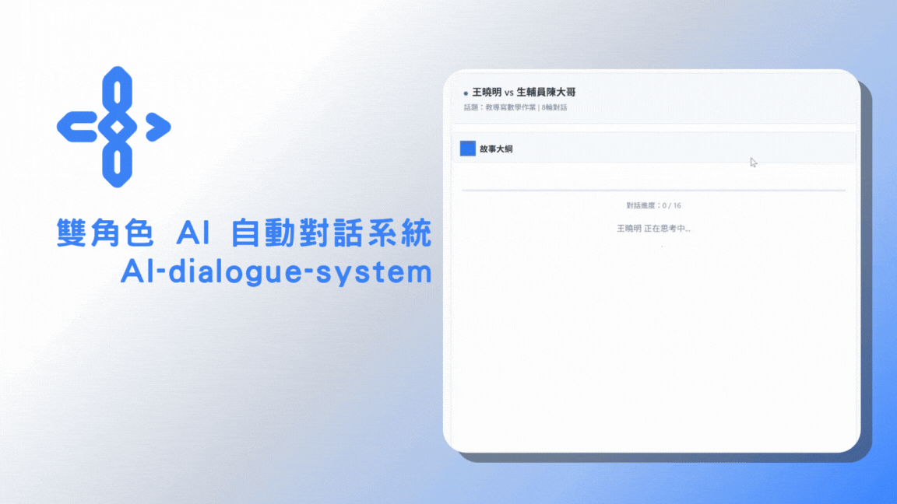
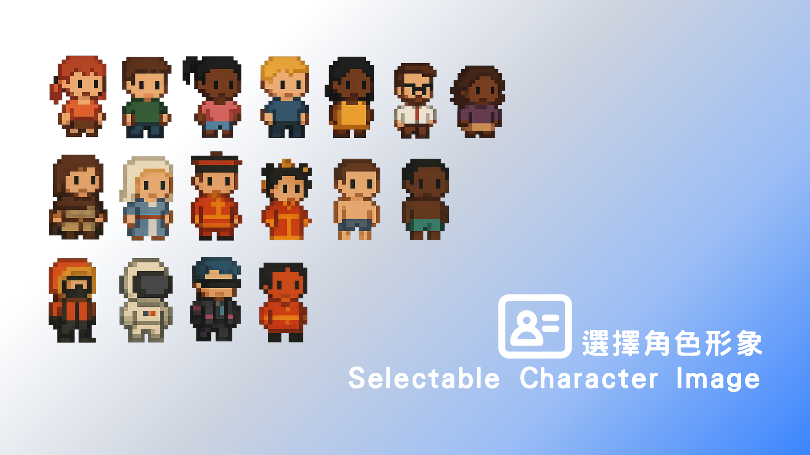
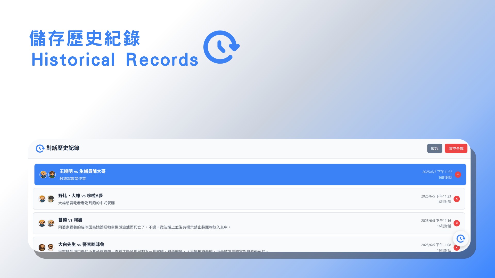
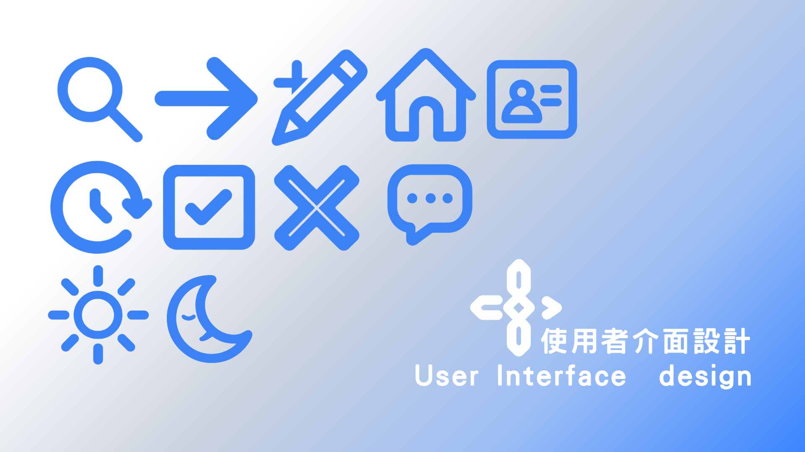

# AI 角色對話系統




[https://ai-dialogue-system.onrender.com](https://ai-dialogue-system.onrender.com)


一個基於 Flask 和 Google Gemini API 的智能對話系統，讓使用者可以設定兩個 AI 角色進行自動對話。

## 功能

 **角色設定**：自訂兩個 AI 角色名稱和特性  
 **話題設定**：設定對話的初始話題  
 **自動對話**：AI 角色會根據設定自動進行對話  
 **參數控制**：可調整字數限制和對話輪次  
 **即時顯示**：對話內容即時顯示，支援深淺色主題  
 **響應式設計**：支援桌面和行動裝置

## 技術架構

- **後端**：Flask + Flask-SocketIO
- **前端**：HTML5 + CSS3 + JavaScript + Socket.IO
- **AI 引擎**：Google Gemini Pro API
- **部署平台**：Render.com

## 使用說明
### 基本操作

1. **設定角色**：在左側面板輸入兩個角色的名稱
2. **描述角色**：可以為角色附帶描述
2. **設定話題**：輸入想要討論的話題
3. **調整參數**：
   - 字數上限：每次回應的最大字數
   - 對話輪次：總共進行的對話輪數
4. **開始對話**：點擊下方按鈕開始對話
5. **觀看對話**：系統會自動生成對話內容

### 角色設定建議

- 使用具體的人物名稱（如：伊隆·馬斯克、比爾·蓋茲）
- 也可以使用虛構角色（如：樂觀的創業家、謹慎的投資者）
- 角色特性會影響對話風格和觀點

### 話題建議

- 在話題中可進行事時地物的描述，也可以隨意地設定對話主題

## 專案結構

```
-AI-/
├── images/
│   ├── 1.gif
│   ├── 2.png
│   ├── 3.png
│   └── 4.png
├── static/
│   └── image/
│       ├── icon/
│       │   ├── icon-1.png
│       │   ├── icon-2.png
│       │   └── ...（共12張圖）
│       └── role/
│           ├── role-1.png
│           ├── role-2.png
│           └── ...（共24張圖）
├── templates/
│   └── index.html
├── .AI-.code-workspace
├── .env
├── Dockerfile
├── render.yaml
├── requirements.txt
├── app.py
└── README.md

```

### 自訂功能

- **自訂人物樣式**：提供數個人物樣式供用戶選擇


- **儲存歷史紀錄**：在localstorage中存取使用紀錄


- **自訂介面設計**：設計使用者介面，更加有商業獨特性


### 環境設定

-**在Render平台部屬環境 並將GeminiAPI Key放入環境當中**

[https://render.com/](https://render.com/)

```
Flask==2.3.3
Flask-SocketIO==5.3.6
google-generativeai==0.3.2
gunicorn==21.2.0
eventlet==0.33.3
python-dotenv==1.0.0

```

-因為覺得想要有更好的呈現方式，將後穿應用串聯前端網頁部屬於平台可以使應用更便利，甚至跨設備使用（手機）

--**Render 平台限制** ：免費版本有輸出流量限制，後端不能一次輸出太多文字；待機十五分鐘會進入休眠（首次進入網頁需要較長時間讀取）

### 遇到的主要挑戰與解決方案

## Ｑ 
**對話容易鬼打牆** ： 在測試時，有發現對話容易僵持不下。陷入空談（會沒有意義講一些雖然像似在對話，卻雙方都不敢真的對對方做些什麼）

## Ａ
**大綱摘要及旁白功能** ：在對話開始前先進行一段大綱摘要的生成，這個生成式用來豐富對話主題的，讓對談能夠依循這個大綱去做推進。另外有開發一個旁白功能，旁白被指使更進一步地推進話題，使兩人的對話能夠被推動。

### 作業目標


```

學生專題作業：雙角色 AI 自動對話系統
1. 專案目標
   本專案旨在讓學生學習並實作一個互動式的 Web 應用程式，該應用程式能夠模擬兩個由AI 扮演的不同角色之間的自動對話。學生將透過此專案熟悉雲端 AI 服務的串接、前端介面設計以及基礎的後端邏輯處理。
2. 核心功能需求
   學生需要建置一個系統，至少包含以下核心功能：
1. 角色設定：
   ○ 使用者可以自行輸入兩個 AI 聊天機器人所要扮演的角色名稱（例如：伊隆·馬斯克 vs. 馬克·祖克柏，或是任何自訂角色）。
2. 初始話題設定：
   ○ 使用者可以設定一個初始的對話話題，作為兩個 AI 角色對話的開端。
3. 自動對話生成：
   ○ 系統接收到角色和話題後，能夠自動驅動兩個 AI 角色輪流針對話題進行對話。
   ○ 每個角色的發言應基於前一輪的對話內容以及其被賦予的角色特性。
4. 對話長度與輪次控制：
   ○ 提供介面讓使用者可以調整 AI 每次回應的字數上限（例如：150 字內）。
   ○ 提供介面讓使用者可以設定總對話的輪次（例如：5-15 輪，每輪包含兩個角色的各一次發言）。
5. 對話顯示：
   ○ 所有對話內容（包含角色名稱與發言）需要即時、清晰地顯示在網頁介面上。
   ○ 介面應能自動滾動，方便使用者閱讀最新的對話。
6. API 金鑰管理：
   ○ 系統需要安全地處理 Google API 金鑰。建議優先從環境變數或 Colab 密鑰讀取，並提供備用的輸入框讓使用者臨時輸入。
7. 錯誤處理與提示：
   ○ 當 API 請求失敗（尤其是請求頻率過高導致的 429 錯誤）或輸入不完整時，系統應能提供友善的錯誤提示給使用者，並適當中止對話。
3. 技術與工具建議
   ● 程式語言：Python
   ● Web 框架/介面庫：Gradio (建議，因其易用性與快速原型開發能力)
   ● 大型語言模型 (LLM) API：Google Gemini API (或其他學生可取得的 LLM API)
   ● API 請求處理：requests Python 函式庫
   ● 開發環境：Google Colaboratory (建議，方便環境設定與 API 金鑰管理) 或本地 Python 環境。
● 版本控制：Git (選修，鼓勵學生使用)
4. 實作步驟建議
1. 環境準備與 API 初探 (第一階段)：
○ 熟悉 Python 基本語法。
○ 學習如何在 Google Colab (或本地) 設定 Python 環境並安裝 gradio 和 requests
套件。
○ 申請並取得 Google Gemini API 金鑰。
○ 撰寫一個簡單的 Python 腳本，練習如何使用 requests 函式庫呼叫 Gemini
API ，並能成功獲取模型的回應。理解 API 的請求格式與回應結構。
○ 學習如何從 Colab 密鑰或環境變數讀取 API 金鑰。
2. Gradio 基礎介面搭建 (第二階段)：
○ 學習 Gradio 的基本元件，如 Textbox, Button, Slider。
○ 搭建出專案所需的基本輸入介面：API 金鑰輸入框、角色 1 名稱、角色 2 名稱、
初始話題、對話輪次滑桿、每輪延遲滑桿。
○ 搭建一個用於顯示對話紀錄的輸出文字框。
○ 將「開始對話」按鈕與一個初步的 Python 函式連結起來，測試介面元件是否能
正確傳遞數值。
3. 核心對話邏輯實作 (第三階段)：
○ 設計 call_gemini_api(prompt_text, api_key) 函式：
■ 接收提示語 (prompt) 和 API 金鑰。
■ 建構符合 Gemini API 要求的請求酬載 (payload)，包含模型設定（如
maxOutputTokens）。
■ 發送 API 請求並處理回應。
■ 進行錯誤處理，特別是針對 HTTP 錯誤 (如 429 Too Many Requests) 和 API
回應格式不符預期的情況。
○ 設計主要的 chatbot_conversation(...) 函式 (Gradio 的核心處理函式)：
■ 獲取使用者從介面輸入的各項參數。
■ 進行輸入驗證（例如，API 金鑰、角色名稱、話題是否為空）。
■ 對話初始化 ：根據初始話題和第一個角色，建構第一個提示語，呼叫
call_gemini_api 產生第一句對話。
■ 對話迴圈：
■ 根據設定的對話輪次進行迴圈。
■ 在每次 AI 回應前，加入可配置的延遲 (time.sleep())。
■ 輪流切換當前回應的角色。
■ 建構包含對話歷史和當前角色指示的提示語，以引導 AI 產生連貫且符合
角色的回應。
■ 呼叫 call_gemini_api 獲取 AI 回應。
■ 若 API 呼叫發生錯誤（特別是 429），應優雅地停止對話並顯示錯誤。
■ 將生成的對話（包含角色名稱）累加到對話紀錄字串中。
■ 使用 yield 即時更新 Gradio 介面上的對話紀錄。
■ 在對話結束或因錯誤中止時，顯示相應的結束訊息。
4. 細化與使用者體驗優化 (第四階段)：
○ 優化提示語 (Prompt Engineering)：嘗試不同的提示語設計，讓 AI 角色的扮演
更生動、對話更自然。
○ 完善錯誤提示：確保所有潛在的錯誤（API 金鑰無效、網路問題、輸入不完整
等）都有清晰的提示。
○ 介面美化：利用 Gradio 的主題或自訂 CSS (選修) 讓介面更美觀。
○ 加入「清除對話紀錄」按鈕 (選修)。
○ 提供一些預設的對話範例 (gr.Examples) 方便使用者快速體驗。
○ 撰寫專案說明文件 (README)，解釋如何設定與執行程式。
5. 評分標準建議 (可依課程調整)
● 功能完整性 (60%)：是否成功實作所有核心功能需求。
● 程式碼品質 (20%)：
○ 程式碼的可讀性、註解是否清晰。
○ 邏輯結構是否合理。
○ 錯誤處理是否完善。
● 使用者介面與體驗 (10%)：介面是否直觀易用，提示訊息是否清楚。
● 創意與額外功能 (10%)：是否有額外的創新點或優化 (例如：更進階的提示工程、儲
存對話紀錄等)。
● 專案報告/演示 (視課程要求)
6. 提交內容建議
● 包含所有 Python 原始碼的 .py 檔案或 Google Colab 筆記本 (.ipynb)。
● 一份簡要的專案說明文件 (例如 README.md)，內容包含：
○ 專案簡介。
○ 如何設定環境 (包含 API 金鑰的設定方式)。
○ 如何執行程式。
○ 遇到的主要挑戰與解決方案 (選填)。
● (選填) 專案演示影片。
希望這份說明能幫助學生們順利完成專案！

```
